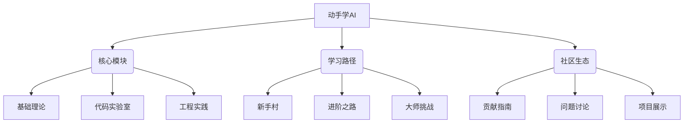
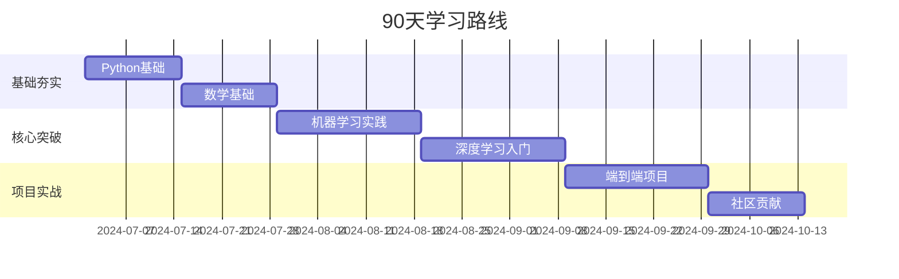

# 项目简介

### 一、项目架构设计


---

### 二、技术栈选型
```bash
# 项目技术架构
.
├── docs/                  # 文档中心（mkdocs生成）
├── labs/                  # 实验代码
│   ├── basic/             # 基础实验（纯Python实现）
│   ├── intermediate/      # 中级实验（PyTorch/TensorFlow）
│   └── advanced/          # 高级实验（分布式训练/模型部署）
├── playground/            # 在线沙箱（Jupyter+Binder）
├── challenges/            # 挑战任务（Kaggle风格数据集）
├── community/             # 社区内容
│   ├── projects/          # 用户作品展示
│   └── discussions/       # 讨论区存档
└── tools/                 # 辅助工具
    ├── setup_env.py       # 环境配置工具
    └── lab_checker.py     # 实验验证脚本
```

---

### 三、内容建设路线
#### 1. 基础理论模块
```markdown
# 文档结构示例
## 线性代数基础
### 核心概念
- 向量空间可视化 [](链接)
- 矩阵分解实践

## 概率论入门
### 重点突破
- 贝叶斯推断实战
- 蒙特卡洛模拟案例
```

#### 2. 代码实验室（关键实验设计）
```python
# 实验示例：手写数字分类进化史
experiments = [
    {
        "title": "从零实现KNN",
        "skills": ["Python基础", "距离度量"],
        "file": "lab1_knn_from_scratch.ipynb",
        "checkpoint": [
            "实现曼哈顿距离函数", 
            "达到85%准确率"
        ]
    },
    {
        "title": "PyTorch闪电战",
        "skills": ["张量操作", "自动微分"],
        "file": "lab2_pytorch_cnn.ipynb",
        "checkpoint": [
            "构建LeNet模型",
            "实现数据增强"
        ]
    }
]
```

#### 3. 工程实践专题
```bash
# 项目级实践案例
1. 智能垃圾分类系统
   - 使用MobileNet迁移学习
   - 模型量化部署到树莓派
   - 实现Flask API服务

2. 新闻标题生成器
   - 基于HuggingFace微调GPT-2
   - 部署FastAPI服务
   - 实现gradio交互界面
```

---

### 四、社区运营机制
#### 1. 贡献者激励体系
```markdown
| 贡献类型       | 奖励机制                  | 成就标识           |
|---------------|-------------------------|--------------------|
| 提交实验代码   | 加入贡献者名单           | 🥇代码大师徽章      |
| 修复文档错误   | GitHub星标贡献者         | 📚文档守护者徽章    |
| 解答问题       | 优先项目推荐位           | 💡问题终结者徽章    |
```

#### 2. 自动化协作工具
```yaml
# GitHub Actions配置示例
name: Lab Check
on: [pull_request]

jobs:
  check-notebooks:
    runs-on: ubuntu-latest
    steps:
    - uses: actions/checkout@v2
    - name: Set up Python
      uses: actions/setup-python@v2
    - name: Install dependencies
      run: pip install -r requirements.txt
    - name: Run Notebook Tests
      run: |
        python tools/lab_checker.py \
          --notebooks labs/basic/*.ipynb \
          --timeout 600
```

---

### 五、学习路径设计


---

### 六、项目启动清单
1. [ ] 创建GitHub仓库并添加LICENSE（建议Apache 2.0）
2. [ ] 配置README.md包含：
   ```markdown
   
   [](链接)
   [](社区链接)
   ```
3. [ ] 搭建基础实验框架（至少包含3个完整实验）
4. [ ] 编写贡献指南（CONTRIBUTING.md）
5. [ ] 配置CI/CD流水线（Notebook自动测试）
6. [ ] 创建issue模板（问题报告/功能请求）
7. [ ] 准备首个社区活动（如Hackathon）

---

### 七、推广策略
1. **技术社区渗透**：
   - 在Kaggle数据集添加使用示例
   - 参与PapersWithCode项目关联
2. **内容营销**：
   - 制作B站系列教程（附带项目链接）
   - 撰写Medium技术博客（英文版）
3. **高校合作**：
   - 与MOOC平台合作课程
   - 举办校园AI训练营

---

### 八、长期演进规划
```python
# 版本路线图
roadmap = {
    "v0.1": "基础实验框架+数学基础模块",
    "v0.5": "深度学习实验+在线沙箱环境",
    "v1.0": "完整学习路径+社区功能",
    "v2.0": "自动个性化学习推荐系统",
    "v3.0": "集成云开发环境+AI助教"
}
```

---

立即行动：
1. 使用cookiecutter创建项目模板
   ```bash
   pip install cookiecutter
   cookiecutter https://github.com/drivendata/cookiecutter-data-science
   ```
2. 添加首个交互式实验（推荐从线性回归开始）
3. 在GitHub设置「good first issue」吸引新贡献者

通过清晰的阶段规划+自动化工具链+社区激励机制，打造有生命力的AI学习平台。关键成功要素在于保持内容的前沿性和可操作性，建议每两周更新一个实验案例，每月举办线上代码评审会。