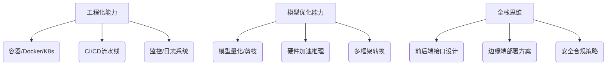

---

### **一、核心能力拆解（部署工程师黄金三角）**


---

### **二、分阶段学习路径（6个月攻坚计划）**

#### **Phase 1：基础能力筑基（1-2个月）**
1. **必学工具链**
   - 容器技术：Docker进阶（多阶段构建/镜像优化） + K8s基础Pod管理
   - 框架转换：ONNX运行时部署（PyTorch→ONNX→TensorRT全流程）
   - 性能分析：PyTorch Profiler / NVIDIA Nsight Systems

2. **重点课程**
   - 《MLOps Engineering at Google》实操手册
   - NVIDIA DLI课程《Deploying AI Models at Scale》

3. **验证项目**
   - 用Docker封装ResNet50模型+Flask API
   - 实现TensorRT对YOLOv8的FP16量化加速

#### **Phase 2：工业级部署进阶（2-3个月）**
1. **核心技术栈**
   - 推理引擎：Triton Inference Server（动态批处理/模型流水线）
   - 云平台：AWS SageMaker Endpoints / Azure ML Online
   - 边缘计算：NVIDIA Jetson TX2部署优化（功耗/显存管理）

2. **高阶技能**
   - 模型量化：QAT(Quant Aware Training) vs PTQ(Post Training Quant)
   - 多设备适配：CoreML（iOS）、TensorFlow Lite（Android）、OpenVINO（Intel）

3. **实战项目**
   - 在K8s集群部署Triton服务（自动扩缩容+Prometheus监控）
   - 开发手机端BERT模型（TensorFlow Lite + TFLite Model Maker）

#### **Phase 3：生产环境实战（1-2个月）**
1. **企业级解决方案**
   - 大模型部署：vLLM框架部署Llama3（PagedAttention技术）
   - 微服务架构：FastAPI+gRPC实现高并发接口
   - 安全防护：模型水印注入/对抗样本检测

2. **行业案例复现**
   - 复现NVIDIA Maxine视频增强方案（实时AI处理管线）
   - 构建医疗影像AIaaS平台（DICOM数据流处理）

---

### **三、技术栈优先级（按企业需求排序）**
| 技术领域         | 关键工具                     | 学习优先级 | 应用场景案例                   |
|------------------|------------------------------|------------|--------------------------------|
| 模型优化         | TensorRT/OpenVINO            | ★★★★★      | 自动驾驶推理延迟优化           |
| 容器编排         | K8s+Helm                     | ★★★★☆      | 电商推荐系统集群部署           |
| 边缘计算         | NVIDIA Jetson/TFLite Micro   | ★★★★☆      | 工业质检设备端部署             |
| 监控系统         | Prometheus+Grafana           | ★★★☆☆      | 金融风控模型QPS监控            |
| 安全合规         | FedML/加密推理               | ★★☆☆☆      | 医疗数据隐私计算               |

---

### **四、求职竞争力提升策略**
1. **证书加持**
   - NVIDIA Jetson AI Specialist（边缘计算方向）
   - AWS Certified Machine Learning Specialty

2. **开源贡献**
   - 参与ONNX Runtime模型优化模块开发
   - 完善HuggingFace Transformers的部署文档

3. **行业洞察**
   - 关注MLPerf推理榜单技术方案（性能优化风向标）
   - 研究Llama.cpp等C++推理框架源码

---

### **五、避坑指南（新手常见误区）**
1. **不要沉迷算法理论**：重点掌握TorchScript导出、ONNX算子兼容性排查等工程问题
2. **警惕"Demo级部署"**：掌握压力测试（Locust）、AB测试、灰度发布等生产级技能
3. **硬件选型思维**：根据吞吐量/延迟要求选择CPU/GPU/TPU（如Intel Sapphire Rapids的AMX指令集优化）

---

**转型关键**：从PyTorch训练代码到Triton推理服务的完整链路打通能力（附学习checklist）：
```python
# 部署工程师能力验证代码示例（模型服务化）
from tritonclient.grpc import InferInput, InferRequestedOutput
import numpy as np

# 创建Triton客户端连接
triton_client = grpcclient.InferenceServerClient(url="localhost:8001")

# 构造输入数据
inputs = [InferInput("INPUT0", [1,3,224,224], "FP32")]
inputs[0].set_data_from_numpy(np.random.random([1,3,224,224]))

# 设置输出请求
outputs = [InferRequestedOutput("OUTPUT0")]

# 执行推理
results = triton_client.infer(
    model_name="resnet50",
    inputs=inputs,
    outputs=outputs,
    headers={"X-Request-ID": "12345"}
)

print(results.as_numpy("OUTPUT0"))  # 成功获取推理结果
```

建议从**模型转换工具链**（如torch.onnx）和**推理服务器配置**（Triton model-config.pbtxt）入手实践，逐步深入硬件层优化。